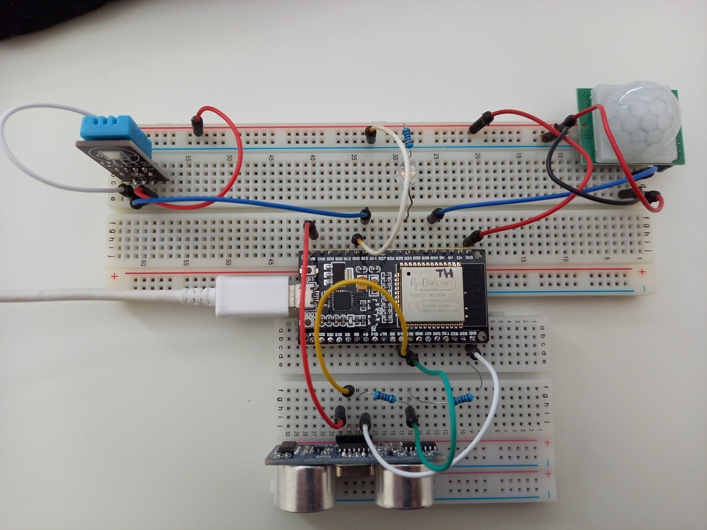

# ESP32 + sensorit




## Etäisyys ultraäänisensorilla (HC-SR04)

**Kuvan kytkennät**

ESP32   | HC-SR04
--------|--------
5V      | Vcc
GND     | Gnd
G18     | Trig
G19     | Echo (Huom! Jännitteen jakaja)

**Esimerkkikoodi**

```python
from machine import Pin
import hcsr04


hcsr = hcsr04.HCSR04(18, 19)

print(hcsr.distance_cm())
```

**Lähteet**

https://lemariva.com/blog/2018/06/tutorial-getting-started-with-micropython-sensors

https://github.com/lemariva/uPySensors/blob/master/hcsr04.py


## Lämpötila ja kosteus (DHT11)

**Kuvan kytkennät**

ESP32   | DHT11
--------|--------
3V3     | +
GND     | -
G13     | Out

**Esimerkkikoodi**

```python
import dht
from machine import Pin

pin13 = Pin(13, Pin.IN, Pin.PULL_UP)
sensor = dht.DHT11(pin13)

def get_temp_and_humidity():
    sensor.measure()

    return (sensor.temperature(), sensor.humidity())
```

**Lähteet**

https://randomnerdtutorials.com/esp32-esp8266-dht11-dht22-micropython-temperature-humidity-sensor/

## PIR-liiketunnistin (HC-SR501)

**Kuvan kytkennät**

ESP32   | HC-SR501
--------|--------
3V3     | +
GND     | -
G32     | Out

**Esimerkkikoodi**

```python
from machine import Pin

pir = Pin(32, Pin.IN)

def handle_motion(pin):
    print('Motion!')

pir.irq(trigger=Pin.IRQ_RISING, handler=handle_motion)
```

**Lähteet**

https://randomnerdtutorials.com/micropython-interrupts-esp32-esp8266/

Liiketunnistimen modifiointi (extra)

https://randomnerdtutorials.com/modifying-cheap-pir-motion-sensor-to-work-at-3-3v/


## Mitä liitäntöjä voin käyttää?

ESP32:n pinnit on dokumentoitu osoitteessa https://randomnerdtutorials.com/esp32-pinout-reference-gpios/

Huom! **GPIO12**-väylän käyttäminen aiheuttaa todennäköisesti seuraavan ongelman käynnistyksessä:

```
rst:0x10 (RTCWDT_RTC_RESET),boot:0x33 (SPI_FAST_FLASH_BOOT)
flash read err, 1000
ets_main.c 371
ets Jun  8 2016 00:22:57

rst:0x10 (RTCWDT_RTC_RESET),boot:0x33 (SPI_FAST_FLASH_BOOT)
flash read err, 1000
ets_main.c 371
ets Jun  8 2016 00:22:57

...
```

Alusta ratkaisu on irroittaa esim sensorien `+`-navat käynnistyksen ajaksi.